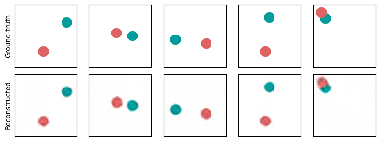

# Interventional Causal Representation Learning

Simple demo for [Interventional Causal Representation Learning by Ahuja et. al. 2022](https://arxiv.org/abs/2209.11924). The code is adapted from the [original code repository](https://github.com/facebookresearch/CausalRepID).

  

